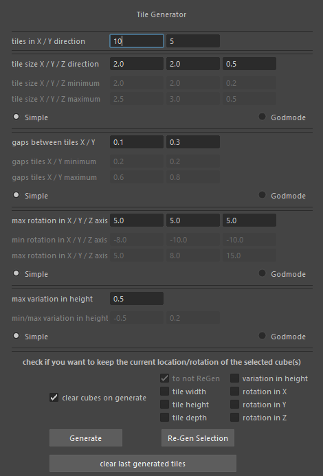

# Tile Generator for Autodesk Maya

## Overview

The **Tile Generator** is a Python script designed for Autodesk Maya to procedurally generate and manage a grid of tiles with random variations.
This tool is ideal for quickly populating environments with tiles or similar objects that require controlled randomness in size, position, height, and rotation.

Within the UI, you can define tile parameters such as size, gaps, rotation, and height variation while maintaining flexibility for re-generation.


## Features

- **Tile Generation**:
  - Create a grid of tiles with user-defined rows and columns.
  - Adjust tile size, spacing (gaps), and height offsets.
  - Randomize tile properties such as rotation and size within a specified range.

- **Tile Management**:
  - Regenerate selected tiles while preserving specific attributes (e.g., size, rotation, height).
  - Clear previously generated tiles for a fresh start.

- **User Interface**:
  - A simple and intuitive UI with options for:
    - Tile count (rows and columns).
    - Tile size (simple or min-max ranges).
    - Gaps between tiles (simple or min-max ranges).
    - Height variation control.
    - Rotation variation control.


## Installation

1. Copy the script into your Maya scripts directory.
2. Launch Autodesk Maya.
3. In the Maya Script Editor, run the following code:

    ```python
    import Tile_Generator
    ui = Tile_Generator.UI("Tile Generator")
    ```

4. The UI will appear, allowing you to configure and generate tiles.


## How to Use

1. **Launch the UI**:
   - Run the script, and a control panel will open.

2. **Set Parameters**:
   - **Tile Count**: Specify the number of tiles in the X and Y directions.
   - **Tile Size**:
     - Use fixed sizes or randomize within a specified range.
   - **Gaps**:
     - Set spacing between tiles, with options for uniform or random gaps.
   - **Height Variation**:
     - Add randomness to the tile height position for natural variations.
   - **Rotation**:
     - Apply random rotation to tiles on X, Y, and Z axes.

3. **Generate Tiles**:
   - Click the **Generate** button to populate the scene with tiles.

4. **Regenerate Tiles**:
   - Select tiles and modify parameters. Use the **Regenerate** button to update them while keeping specific attributes fixed.

5. **Clear Tiles**:
   - Use the **Clear Scene** option to remove previously generated tiles.


## UI Layout



- **Tile Count**: Set the number of tiles in X and Y directions.
- **Tile Size**: Choose between fixed size or min-max ranges for width, height, and depth.
- **Gaps**: Configure spacing between tiles (uniform or random).
- **Height Variation**: Adjust the range of height offsets for tiles.
- **Rotation**: Define rotation limits for X, Y, and Z axes.
- **Regeneration Settings**:
  - Choose which attributes to preserve (size, rotation, height) when regenerating tiles.


## Example

To generate a grid of 10x5 tiles with random sizes and spacing:

1. Set **Tile Count** to `10 x 5`.
2. Enable **Random Tile Size**:
   - Width: `2.0 - 2.5`
   - Height: `2.0 - 3.0`
   - Depth: `0.2 - 0.5`
3. Enable **Random Gaps**:
   - X: `0.23 - 0.55`
   - Y: `0.2 - 0.8`
4. Set **Height Variation** to `-0.5 to 0.2`.
5. Set **Rotation** limits:
   - X: `-8 to 5`
   - Y: `-10 to 8`
   - Z: `-10 to 15`
6. Click **Generate** to create the tiles.


## Requirements

- Autodesk Maya (tested in Maya 2018 and later).


## Notes

- This script was made part of an introduction to Maya Python scripting, don't expect too much of this tool.
- The script offers extensive control over tile properties, making it useful for environment artists and technical artists.
- By preserving specific attributes during regeneration, you can fine-tune tiles without starting over.


## License

This script is free to use and modify. Attribution is appreciated.


## Author

Benjamin Ghys,
Technical Artist
